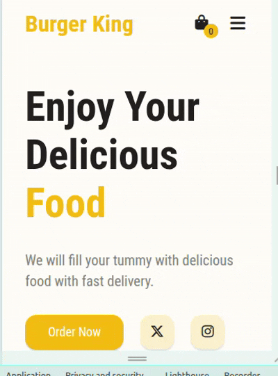

# Project Name: Burger King

## Project Description: 

This is a fully responsive web application built with HTML, CSS, and JavaScript. I made this project to practice DOM manipulation and event handling in JavaScript. In this website, I fetch food data from a JSON file and show it in the Menu Section. From there, I can add food to the cart. In the cart sidebar, I can see all my added food with their price, quantity, and total price, and I can also remove items or increase/decrease their quantity.

## Live Site Link:

https://muhammad-tamim.github.io/web-project-13/  


## Project Video:


## What I Learned New while Building This Project:

### 1. Different Ways to add Google fonts:  

   - Way-1: Inside the HTML:
  
```html
<!DOCTYPE html>
<html lang="en">


<head>
   <meta charset="UTF-8">
   <meta name="viewport" content="width=device-width, initial-scale=1.0">
   <title>Document</title>


   <link rel="preconnect" href="https://fonts.googleapis.com">
   <link rel="preconnect" href="https://fonsts.gstatic.com" crossorigin>
   <link href="https://fonts.googleapis.com/css2?family=Roboto+Condensed:ital,wght@0,100..900;1,100..900&display=swap"
       rel="stylesheet">
   <link rel="stylesheet" href="styles/style.css">


</head>


<body style="font-family: 'Roboto Condensed';">
   <h1>Hello</h1>
</body>

</html>

```

OR 

```html 
<!DOCTYPE html>
<html lang="en">


<head>
   <meta charset="UTF-8">
   <meta name="viewport" content="width=device-width, initial-scale=1.0">
   <title>Document</title>


   <link rel="preconnect" href="https://fonts.googleapis.com">
   <link rel="preconnect" href="https://fonsts.gstatic.com" crossorigin>
   <link href="https://fonts.googleapis.com/css2?family=Roboto+Condensed:ital,wght@0,100..900;1,100..900&display=swap"
       rel="stylesheet">
   <link rel="stylesheet" href="styles/style.css">
</head>


<body>
   <h1>Hello</h1>
</body>


</html>
```
```css
body {
   font-family: "Roboto Condensed";
}

```  
   - Way-2: Inside the CSS  
  
```css
@import url('https://fonts.googleapis.com/css2?family=Roboto+Condensed:ital,wght@0,100..900;1,100..900&display=swap');


body {
   font-family: 'Roboto Condensed';
}
```
**NOTE:** @import is slower than <link> because it blocks rendering until CSS is loaded.

### 2. Full PageVisualization:

If we set the border to the universal selector, then we got something like this:

```css
* {
   margin: 0;
   padding: 0;
   box-sizing: border-box;
   font-family: 'Roboto Condensed';
   background-color: var(--eye-ball);
   border: 1px solid red;
}
```


### 3. How to create a Hamburger Menu for mobile screen:



### 4. CSS Logical Properties:
-  Inline = horizontal (left to right)
-  Block = Vertical (top to bottom)

```css
padding-inline: 1.5rem;   /* shorthand for inline-start + inline-end */
padding-inline-start: 1.5rem;
padding-inline-end: 1.5rem;

padding-block: 1rem;      /* shorthand for block-start + block-end */
padding-block-start: 1rem;
padding-block-end: 1rem;

margin-inline: 1.5rem;
margin-block: 1rem;

inset: 0 -500px 0 auto; /*top 0 right -500px bottom 0 left auto; */
```
### 4. HTML Entity: 

```html 
 <a href="#" class="btn">Sign In &nbsp; <i class="fa-solid fa-arrow-right-from-bracket"></i></a>
```
here, 

- ```&nbsp;``` (non-breaking space) = It represents a space character

### 5.   
```css
.cart-icon .cart-value {
    position: absolute;
    top: 50%;
    right: -10px;
    font-size: .85rem;
    width: 20px;
    line-height: 20px;
    aspect-ratio: 1;
    border-radius: 100vw;
    background: var(--gold-finger);
    color: var(--lead);
    text-align: center;
}
```
here, 
- ```width: 20px; line-height: 20px;``` = This makes it vertically center
- ``` aspect-ratio: 1;``` = makes height = width, so the element stays a perfect square regardless of width.


### 6. How to integrate swiper on project:


**Note:** Swiper js not work if we not use defer on the script in the head tag:

```html
    <!-- Swiper -->
    <link rel="stylesheet" href="https://cdn.jsdelivr.net/npm/swiper@11/swiper-bundle.min.css" />
    <script defer src="script/main.js"></script>
```

### 7. How to properly use css variables:

```css
:root {
    --lead: #212121;
    --gold-finger: #F2BD12;
    --eye-ball: #FFFDF7;
    --hint-yellow: #FCF1CC;
    --pure-white: #FFFFFF;
}
```
### 8. How to hide scrollbar:  

```css
.cart-list::-webkit-scrollbar {
    width: 0;
}
```

### 9. How to use transform property properly:  
The transform property lets you visually change an element without actually affecting its surrounding layout.
```css
transform: translateX(100px);
transform: translateY(-50px);
transform: translate(100px, -50px);
```

### 10. How to use js replace method: 

```js
const price = parseFloat(item.querySelector(".item-total").textContent.replace("$", ""));
```
here,
- .replace(find, replaceWith) = In this case: find "$" and replace with "" (empty string). 

## Contact With Me: 

[](mailto:contact2tamim@gmail.com)
[](https://www.linkedin.com/in/tamim-muhammad/)

---

### Thank you so much for checking out my project! If you have any suggestions or feedback, feel free to share them.

